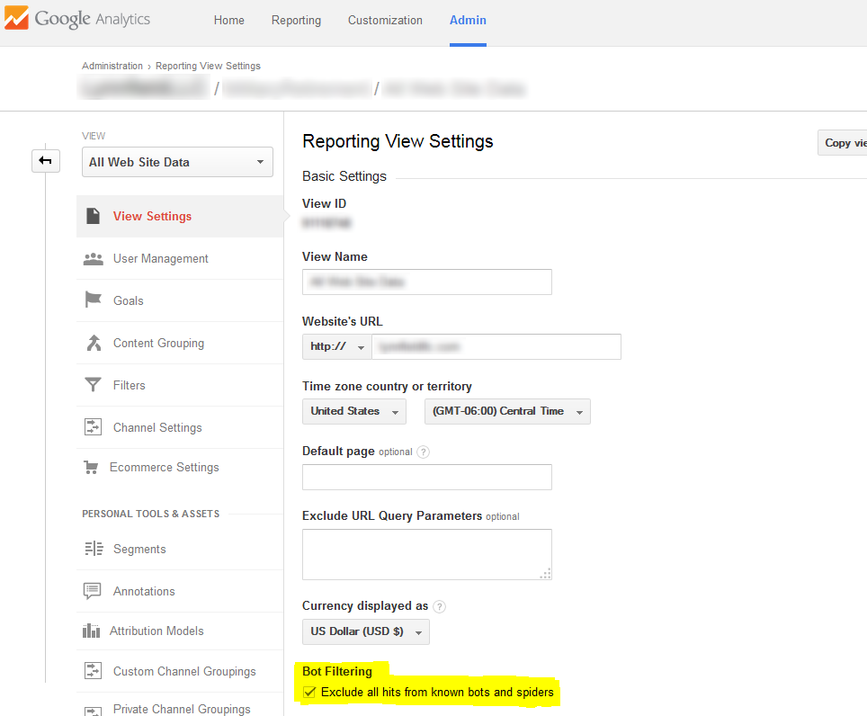

It's been a while since I've posted. I'm not sure if anyone even reads my posts anyway... If only there were a way to see if anyone reads them... Which reminds me...

Once upon a time, I set up Google Analytics on a couple websites. The immediate results were actually really neat. I could see that people were visiting the sites.

<!-- more -->

Well, it was all really neat until I really dug into the details. Then I noticed something that I thought was odd. Most of the hits were from Brazil; in fact, nearly 50% of the hits were from Brazil. ON BOTH SITES. Two independent sites. Both with similar results. Why are there so many views from Brazil. One of the sites is for an application I have that is for retiring United States Military service members. Why would someone in Brazil care about that?

I overheard [Josh Rogers](http://joshuarogers.net), who first showed me Google Analytics, mention his own analytics page and bot filtering. I mentioned my site views from Brazil, and he mentioned having similar views from Brazil. If you are truly an astute observer, you might have guessed that either nothing I found by searching Google seemed like an obvious answer OR I didn't look through the search results well enough. Honestly, It was probably the latter one, but I hope you didn't guess that one :)

I then searched far and wide inside the deep forest of Google Analytics. Then I found a checkbox for "Bot Filtering".

First, go to the Admin section at the top. Then, click on the "View Settings" in the rightmost column.

There will be an option for "Exclude all hits from known bots and spiders".

There you have it! Bot filtering is now enabled on your Google Analytics enabled site![^1]

[^1]: I haven't had the setting turned on for long enough to determine how effective it is (I just enabled it earlier today).
